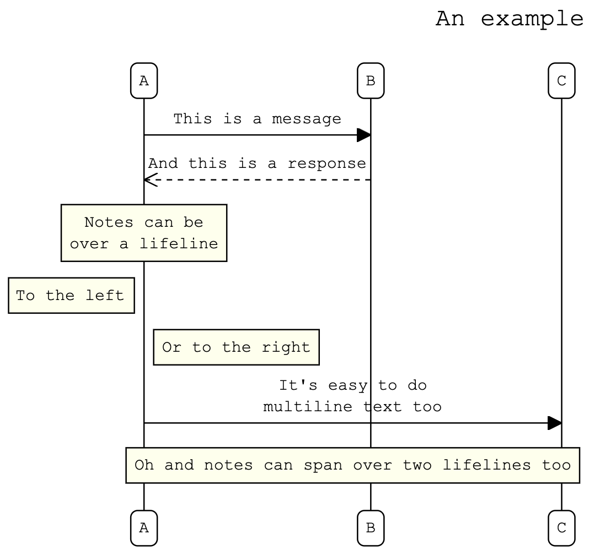
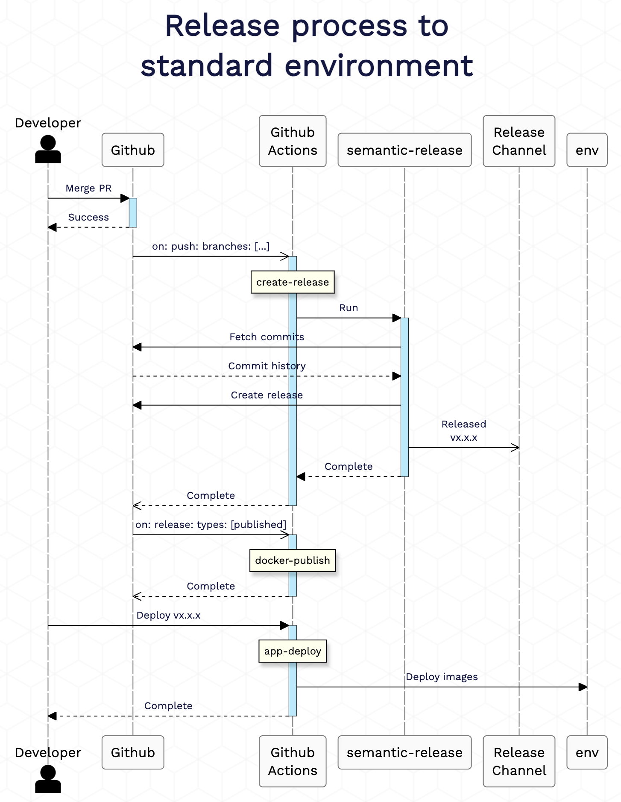

# jasdjs - Just Another Sequence Diagrammer js

Generate a Sequence Diagram from a text representation.

For example:

```
title: An example

A -> B: This is a message
B -->> A: And this is a response
note over A: "Notes can be
over a lifeline"
note left of A: To the left
note right of A: Or to the right
A -> C: "It's easy to do
multiline text too"

note over A, C: Oh and notes can span over two lifelines too
```



JASDjs is allows you to create visually appealing documentation for your organisation.



[Try it out online here.](https://killij.github.io/jasdjs)


## Installation

```npm install jasdjs```

## Getting started
This project is in its infancy atm, so please be patient.

## Language Specification

### Diagram Title

```
title: An example
```

### Participants (Life lines)
Standard participants can either be declared inline in message declarations, e.g.
```
a -> b: message text
```
but can also be declared with an [optional] alias, e.g.
```
ll: a
ll: a as John
```

In the above, you can then use ```a``` in the message declarations whilst ```John``` will appear above and below the lifelife.

Actors need to be declared before they are used, again they can have an optional alias:
```
actor: a
actor: a as John
```

### Messages
Messages are specified between the source and target pariticipants and are separated by an arrow.

```
source arrow target: text
```

Where ```source``` and ```target``` are the ids of pariticipants (if not previously declared, they will be created).

```arrow``` can have have a solid or dashed line, dicatated by either a single or double dash (- or --), and an either a solid or open arrow head, dicatated by a single or double right chevron character (> or >>).

For example:
```
a -> b: Solid line, closed head 
b -->> a: Dashed line, open head
```

#### Activations
Use a plus and minus signs (+/-) after an arrow to activate or deactivate a lifeline respectively.
```
a ->+ b: this activates b
b ->- a: this deactivates b
```

### Notes
Notes can either be ```left of```, ```right of``` or ```over``` life lines.

```
note left of a: some text
note right of a: some text
note over a: some text
```

```note over``` can optionally span two life lines:
```
note over a, b: some text
```

### Multiline text
Diagram elements can display multiline text by enclosing the text in double quotes:

```
title: "A Multiline
Title"
Jack -> John: "This is a
multiline message"
note over Jack, John: "This is a
multiline note"
```

## Comments
Both single and multiline comments are supported
```
// single line comment

/*
Multiline
comment */
```

## Sponsors

- [Talent Consulting](https://www.talentconsulting.uk/)

## License
[MIT](LICENSE)
